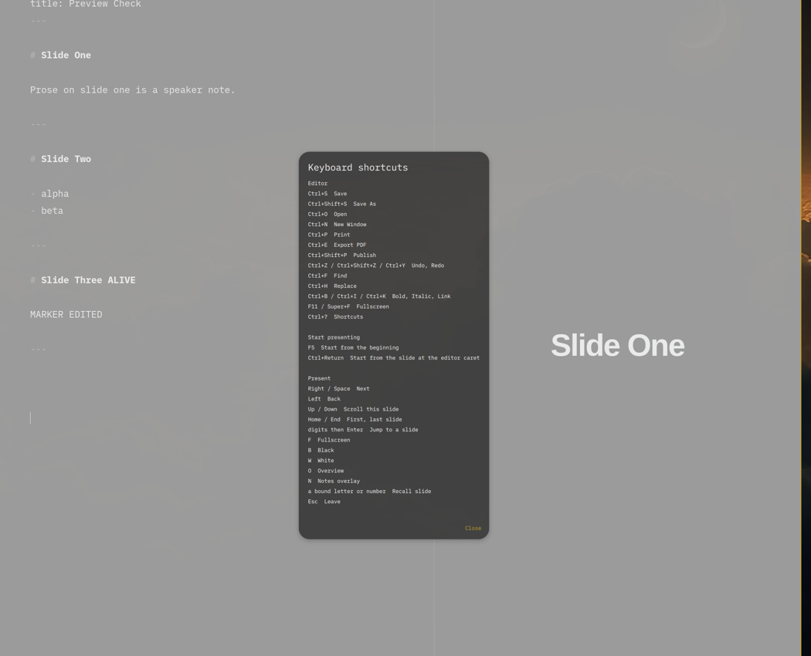

# Omapresent

[](LICENSE)
[](https://omarchy.org)
[](https://github.com/jethrojones/omapresent)

A dead-simple, Markdown-only presentation app for Omarchy. Open any Markdown file and it is already a presentation. No styling, no slide masters, no layout fiddling — the structure of your writing *is* the deck.

<!-- Screenshot placeholder -->
<p align="center">
  
</p>

## Start a presentation

Open a deck in Omapresent. Then choose one path:

- Press `F5` to start from the beginning.
- Press `Ctrl+Return` to start from the current editor slide.
- Click `Present` in the footer to start from the current editor slide.
- From a terminal, run `omapresent present FILE` to start the deck.

## Screen sharing on Omarchy and Hyprland

The editor and audience are separate native windows. In the editor, click the footer `Present` button to start from the current editor slide.

For a call or recording, share the audience window. If presentation is already running, choose the window source titled `<deck title> — Omapresent`, or `Omapresent` when no deck title is set. Do not choose `aquamarine - WAYLAND-1`; that is the outer compositor/output. The share portal may show its own label. Omapresent does not control that label.

---

## Highlights

- **The Markdown is the source of truth.** Any `.md` file is a valid presentation. A file without separators is one long scrollable slide.
- **You never style anything.** It is beautiful by default because it inherits your desktop Omarchy theme (`colors.toml`). There are no color or font dials.
- **Writing structure = slide structure.**
  - Headings, indented outlines, lists, code, tables, block quotes, math, and media are what the **audience** sees.
  - Plain paragraph prose is automatically extracted as **speaker notes** (visible only in the presenter view and web subtitles).
- **Readable text stays readable.** Omapresent keeps your chosen text size. It does not shrink a crowded slide to fit.
- **Tall slides scroll.** If a slide is taller than the audience window, that slide gets vertical scrolling. The audience mirrors the presenter's scroll position.
- **Bento layouts & rich media.** Consecutive images automatically tile into CSS Bento grids. Bare video URLs (YouTube, Vimeo, etc.) become interactive players; other bare URLs become scannable QR codes with captions.
- **Dual-window present mode.** Automatically routes the audience view fullscreen to external monitors while giving you a dedicated presenter cockpit (notes, timer, clock, next-slide preview, recall keys).
- **Rapid recall uses QWERTY keys.** Tag a separator (`--- {q}`) to bind the next slide to `Q`. Press `Q` to show it. Press `Q` again, `Space`, or `Esc` to return to the exact slide, fragment, and scroll position.
- **Export & Pluggable Publish.** Export pixel-identical PDFs (`Ctrl+E`) or publish static web bundles (`Ctrl+Shift+P`) with both interactive slide and long-read article formats via `here.now`, S3/B2, or custom shell commands.

---

## Installation

### Omarchy Package Repository
The package submission is prepared, but `omapresent` is not in the Omarchy
package repository yet. Do not use `pacman -S omapresent` until that changes.
See [`pkgbuild/RELEASING.md`](pkgbuild/RELEASING.md) for the release and
submission steps.

### Build from Source
```bash
git clone https://github.com/jethrojones/omapresent.git
cd omapresent
./bin/build
./bin/install
```

### Dependencies
- Runtime: `hicolor-icon-theme`, `qt6-base`, `qt6-declarative`,
  `qt6-webengine`, `qt6-webchannel`, `qt6-multimedia`,
  `xdg-desktop-portal`, and `ttf-ia-writer`
- Build only: `imagemagick`
- The package does not use GStreamer or bundle fonts. QtWebEngine supplies the
  HTML video path, and the iA Writer S fonts come from the system package.

---

## Keyboard Reference

### Editor Shortcuts
| Shortcut | Action |
| :--- | :--- |
| `Ctrl+S` | Save (opens portal picker for untitled files) |
| `Ctrl+Shift+S` | Save As |
| `Ctrl+O` | Open file |
| `Ctrl+N` | New window |
| `Ctrl+P` | System print dialog |
| `Ctrl+E` | Export PDF slides |
| `Ctrl+Shift+P` | Publish presentation to web |
| `Ctrl+Z` / `Ctrl+Shift+Z` / `Ctrl+Y` | Undo / Redo |
| `Ctrl+F` | Find in document (`Enter` next, `Shift+Enter` previous) |
| `Ctrl+H` | Find & Replace |
| `Ctrl+B` / `Ctrl+I` / `Ctrl+K` | Insert bold / italic / link Markdown |
| `Super+F` | Toggle editor fullscreen |
| `F5` | Start from the beginning |
| `Ctrl+Return` | Start from the current editor slide |
| `Ctrl+?` | Shortcut reference sheet |

### Present Mode Shortcuts
| Shortcut | Action |
| :--- | :--- |
| `Space` / `→` | Next fragment or advance slide |
| `←` | Previous fragment or step back |
| `↑` / `↓` / `PgUp` / `PgDn` / `Wheel` | Scroll current slide (mirrored on audience display) |
| `Home` / `End` | Jump to first or last slide |
| `Digits` + `Enter` | Jump directly to slide number |
| `F` | Toggle fullscreen (audience window) |
| `B` / `W` | Black out / White out audience display (toggle) |
| `O` | Toggle slide overview grid |
| `N` | Toggle presenter notes overlay (single-monitor mode) |
| *Bound Key (e.g. `Q`)* | Toggle recall overlay slide |
| `Esc` | Exit presentation mode |
| `Ctrl+?` | Shortcut reference sheet |

---

## Credits & License

Omapresent is open-source software licensed under the **MIT License**.

Started from the foundation of **Omawrite** by David Heinemeier Hansson (© 2026 David Heinemeier Hansson). Extended and adapted for presentations by Jethro Jones (© 2026 Jethro Jones). See `LICENSE` and `NOTICE` for details.
